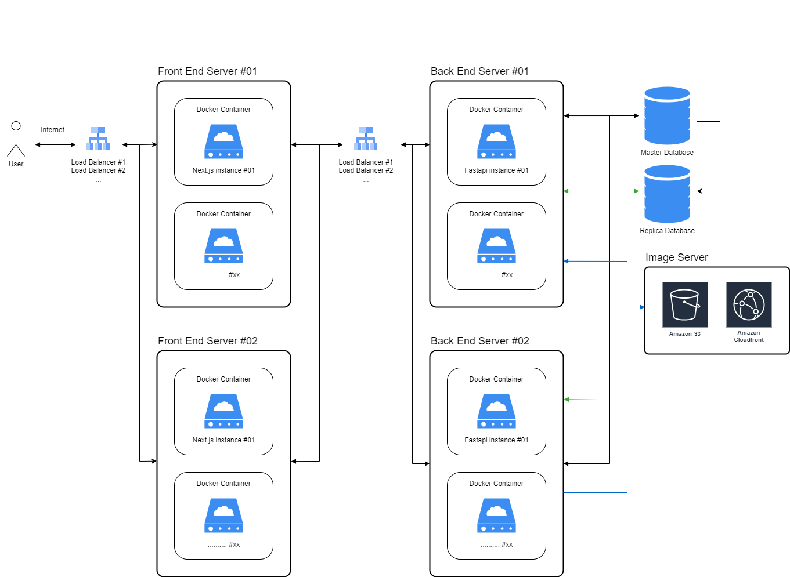

# P. Assignment

This assignment is divided into two projects: a back-end project using Python FastAPI and a front-end project built with Next.js and React.

## Server architecture

If I had access to the necessary servers and time, I would set up the architecture as outlined below. This design is based on the following considerations:

- **Zero downtime**: If the server's operating system needs an update, the load balancer can be adjusted to redirect traffic, ensuring continuous availability.
- **Faster image download speeds and caching**: By leveraging AWS S3 and CloudFront (with global distribution), we can significantly improve performance.
- **Traffic distribution**: Using a load balancer, along with multiple Docker containers and servers, helps evenly distribute traffic and optimize resource utilization. Additionally, by implementing a master-slave database configuration, we can optimize database performance. The master database handles write operations, while the slave(s) handle read operations, reducing the load on the master and improving overall efficiency for read-heavy applications.

Currently, both projects are implemented on a single server because I don't have separate servers and a dedicated database available.



# Backend

## Features

- Upload images in various formats (PNG, BMP, etc.)
- Resize images while maintaining aspect ratio
- Store original images and compressed versions
- Check for existing images using MD5 hash
- Update image dimensions and URLs
- Delete images from the server
- Serve images with a timestamp
- CORS support for cross-origin requests

## Project Structure

```
api.task.io.image/
├── app/
│   ├── controllers/
│   │   ├── __init__.py
│   │   ├── image_controller.py
│   │   └── local_image_controller.py
│   ├── models/
│   │   ├── __init__.py
│   │   ├── database.py
│   │   └── image_schema.py
│   ├── services/
│   │   ├── __init__.py
│   │   ├── image_service.py
│   │   └── local_image_service.py
│   ├── utils/
│   │   ├── __init__.py
│   │   ├── file_utils.py
│   │   └── s3_utils.py
│   ├── __init__.py
│   ├── config.py
│   └── main.py
├── logs/
│   └── app.log
├── uploaded_images/
├── image_list.json
├── .env
├── Dockerfile
├── README.md
└── requirements.txt
```

## Installation

1. Clone the repository:
   ```bash
   git clone https://github.com/yourusername/my_fastapi_project.git
   cd my_fastapi_project
   ```

2. Create a virtual environment and activate it:
   ```bash
   python -m venv venv
   source venv/bin/activate  # On Windows use `venv\Scriptsctivate`
   ```

3. Install the required packages:
   ```bash
   pip install -r app/requirements.txt
   ```

4. Create a `.env` file with your environment variables:
   ```plaintext
   PORT=8000
   ALLOWED_HOSTS=*
   ```

## Running the Application

To run the FastAPI application, use the following command:

```bash
uvicorn app.main:app --host 0.0.0.0 --port $PORT --reload
```

## API Endpoints

- **Upload Image**: `POST /upload`
- **Get Image**: `GET /image/compressed/{md5}`
- **Update Image Dimensions**: `PUT /images/resize/{md5}`
- **Delete Image**: `DELETE /images/delete/{md5}`
- **Get All Images**: `GET /images/list`

## Example Request to Update Image Dimensions

```javascript
export const updateImageDimensions = async (md5, updateData) => {
  return axios.put(`${API_HOST}/images/resize/${md5}`, updateData, {
    headers: { 'Content-Type': 'application/json' },
  });
};
```

## Contributing

Contributions are welcome! Please feel free to submit a pull request or open an issue for any suggestions or improvements.

## License

This project is licensed under the MIT License.
